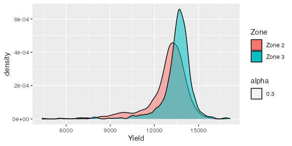

```{r include = F}
library(knitr)
library(officedown)
library(officer)

opts_chunk$set(
  fig.align = "center",
  fig.retina = 5,
  warning = FALSE,
  message = FALSE,
  cache = FALSE,
  echo = FALSE
)
```

```{r eval = F}
# This is for you to set working directory easily. This serves no purpose in knitting to a manuscript
setwd("/Users/tmieno2/Dropbox/TeachingUNL/DataScience/LectureNotes/Chapter-9-WritingArticle")
```

```{r packages}
library(patchwork)
library(flextable)
library(officer)
library(modelsummary)
library(tidyverse)
```

```{r data-preparation}
#--- read the regression data ---#
reg_data <- readRDS("reg_data.rds") %>%
  .[, Zone := case_when(
    tgt_comb == "36-124" ~ "Zone 3",
    tgt_comb == "34-134" ~ "Zone 2",
  )] %>%
  filter(!is.na(Zone))
```

# Introduction

The issue this article addresses is **super** *important*!

+ **author names and year**: @schlenker2009nonlinear examined ....

+ **author names and year in parentheses**: [@schlenker2009nonlinear]

+ **multiple citations in parentheses**: [@schlenker2009nonlinear; @mas1995microeconomic]

+ **only year in parentheses**: [-@schlenker2009nonlinear]

<!-- page break -->

`r run_pagebreak()`

# Materials and Methods

This line break does not work: <br> See?

This line break does work:
<br>

See?

## Data

```{r}
#--- number of observations by zone ---#
num_obs <-
  reg_data %>%
  group_by(Zone) %>%
  summarize(n = n())

num_obs_z2 <- filter(num_obs, Zone == "Zone 2")$n
num_obs_z3 <- filter(num_obs, Zone == "Zone 3")$n
```

The number of observations are `r num_obs_z2` and `r num_obs_z3` for Zones 2 and 3, respectively.

Table \@ref(tab:summary-statistics) presents summary statistics by zone.

## Statistical Model

See equation \@ref(eq:eqn1) and \@ref(eq:eqn2) for the statistical models we use.

\begin{equation}
y = \beta_0 + \beta_1 x + \varepsilon
(\#eq:eqn1)
\end{equation}

\begin{align}
Y_z & = f_z(S) + g_z(N) + h_z(X,Y) + \varepsilon_z \\
& = \sum_{i=1}^k \phi_k(S) + g_z(N) + h_z(X,Y) + \varepsilon_z (\#eq:eqn2)
\end{align}

Our target coefficient is $\beta_1$ (in-line math).

# Results and Discussions

Table \@ref(tab:reg-table) presents the regression results.

Figure \@ref(fig:fig-1) presents the distribution of yields by zone.

# Conclusions

bluh bluh^[This is a footnote], another bluh bluh^[This is the second footnote]

`r run_pagebreak()`

# Figures

I like Figure \@ref(fig:fig-1) a lot.

```{r fig.id = "fig-1", fig.cap = "The Distribution of Yield by Zone", fig.width = 5, fig.width = 4, dpi = 400}
g_plot <-
  ggplot() +
  geom_density(
    data = reg_data,
    aes(
      x = Yield,
      fill = Zone,
      alpha = 0.3
    )
  )

g_plot
```

```{r}
ggsave(filename = "g_plot_external.png", g_plot, dpi = 100, width = 6, height = 3)
```

`r run_pagebreak()`

Figure \@ref(fig:imported-plot) was imported.

```{r, fig.id = "imported-plot", fig.cap = "Imported Plot", fig.width = 4, dpi = 600}

```


# Tables

```{r, tab.id = "summary-statistics", tab.cap = "Summary Statistics by Zone"}

#--- find observations ---#
# write the function that forces the number of observations to be presented as integers
get_N <- function(x) {
  length(x) %>% as.integer()
}

#--- create a summary table by zone ---#
summary_table <-
  reg_data %>%
  datasummary(
    Zone * (
      (`Yield (kg/ha)` = Yield) +
        (`Nitrogen Rate (kg/ha)` = aa_n) +
        (`Seed Rate (1000/ha)` = aa_s)
    ) ~
      Format(digits = 1) * get_N + Mean + SD + Min + Max,
    data = .,
    output = "flextable"
  ) %>%
  autofit() %>%
  hline(
    i = 3,
    border = fp_border(width = 1)
  )

summary_table
```

## Use the `modelsummary` package to create regression results tables

```{r, tab.id = "reg-table", tab.cap = "Regression results table by the modelsummary function"}
#--- regressions ---#
lm_1 <- fixest::feols(mpg ~ hp + cyl, data = mtcars)
lm_2 <- fixest::feols(mpg ~ hp + cyl + wt, data = mtcars)
lm_3 <- fixest::feols(mpg ~ hp + cyl + wt, cluster = ~ vs, data = mtcars)

#--- create a regression results table ---#
modelsummary::modelsummary(
  list(lm_1, lm_2, lm_3),
  output = "flextable",
  gof_omit = "IC|Log|Adj|F|Pseudo|Within"
) %>%
  autofit() %>%
  hline(8) # add horizontal line. modelsummary() adds horizontal line separating coefficient estimates and model summary statistics. But, it disappears on WORD for some reason. So, it is manually added here.

```

Table \@ref(tab:reg-table) shows the regression results.

<br>

```{r, tab.id = "sum-stat", tab.cap = "Summary statistics table by the datasummary function"}
modelsummary::datasummary(
  mpg + hp + cyl ~ Mean + SD,
  data = mtcars,
  output = "flextable"
)
```

Table \@ref(tab:sum-stat) shows summary statistics.

## The `gt` package does not work well

See that the `gt` package does not work well as of `r Sys.Date()`. The `as_word()` function works if you are using the output class of `word_document`. We are using `officedown::rdocx_document`.

```{r, tab.id = "table-from-gt", tab.cap = "A table created by the gt package", eval = F}
library(gt)
(
  tab_1 <-
    exibble %>%
    gt(
      rowname_col = "row",
      groupname_col = "group"
    )
)
as_word(tab_1)
```


# References

::: {#refs}
:::


# Appendix

+ item 1
+ item 2
+ item 3

---

+ item 1
  - item 1.1 
  - item 1.2 
+ item 2
+ item 3

---

1. item 1
2. item 2
3. item 3