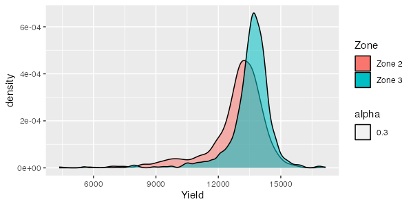

```{r include = F}
library(knitr)
library(officedown)
library(officer)

opts_chunk$set(
  fig.align = "center",
  fig.retina = 5,
  warning = FALSE,
  message = FALSE,
  cache = FALSE,
  echo = FALSE
)
```

```{r eval = F}
# This is for you to set working directory easily. This serves no purpose in knitting to a manuscript
setwd("/Users/tmieno2/Dropbox/TeachingUNL/DataScience/LectureNotes/Chapter-9-WritingArticle")
```

```{r packages}
library(patchwork)
library(flextable)
library(officer)
library(modelsummary)
library(tidyverse)
```

```{r data-preparation}
#--- read the regression data ---#
reg_data <- readRDS("reg_data.rds") %>%
  .[, Zone := case_when(
    tgt_comb == "36-124" ~ "Zone 3",
    tgt_comb == "34-134" ~ "Zone 2",
  )] %>%
  filter(!is.na(Zone))
```

\newpage

# Introduction

The issue this article addresses is **super** *important*!

+ **author names and year**: @schlenker2009nonlinear examined ....

+ **author names and year in parentheses**: [@schlenker2009nonlinear]

+ **multiple citations in parentheses**: [@schlenker2009nonlinear; @mas1995microeconomic]

+ **only year in parentheses**: [-@schlenker2009nonlinear]


# Materials and Methods

## Data

```{r}
#--- number of observations by zone ---#
num_obs <-
  reg_data %>%
  group_by(Zone) %>%
  summarize(n = n())

num_obs_z2 <- filter(num_obs, Zone == "Zone 2")$n
num_obs_z3 <- filter(num_obs, Zone == "Zone 3")$n
```

The number of observations are `r num_obs_z2` and `r num_obs_z3` for Zones 2 and 3, respectively.

Table \@ref(tab:summary-statistics) presents summary statistics by zone.

## Statistical Model

See equation \@ref(eq:eqn1) and \@ref(eq:eqn2) for the statistical models we use.

\begin{equation}
y = \beta_0 + \beta_1 x + \varepsilon
(\#eq:eqn1)
\end{equation}

\begin{align}
Y_z & = f_z(S) + g_z(N) + h_z(X,Y) + \varepsilon_z \\
& = \sum_{i=1}^k \phi_k(S) + g_z(N) + h_z(X,Y) + \varepsilon_z (\#eq:eqn2)
\end{align}

Our target coefficient is $\beta_1$ (in-line math).

Here is the Latex way.

```{=tex}
\begin{align}
Y_z & = f_z(S) + g_z(N) + h_z(X,Y) + \varepsilon_z \notag \\
& = \sum_{i=1}^k \phi_k(S) + g_z(N) + h_z(X,Y) + \varepsilon_z \label{eq-tex}
\end{align}
```

Equation (\ref{eq-tex}).

# Results and Discussions

Table \@ref(tab:reg-table) presents the regression results.

Figure \@ref(fig:fig-1) presents the distribution of yields by zone.

# Conclusions

bluh bluh^[This is a footnote], another bluh bluh^[This is the second footnote]

\newpage

# Figures {-}

I like Figure \@ref(fig:fig-1) (flushed left) a lot.

```{r fig-1, fig.cap = "The Distribution of Yield by Zone", fig.width = 4, fig.height = 4, fig.align = "left"}
g_plot <-
  ggplot() +
  geom_density(
    data = reg_data,
    aes(
      x = Yield,
      fill = Zone,
      alpha = 0.3
    )
  )

g_plot
```

```{r}
ggsave(filename = "g_plot_external.png", g_plot, dpi = 100, width = 6, height = 3)
```

Figure \@ref(fig:imported-plot) was imported.

```{r imported-plot, fig.cap = "Imported Plot", fig.width = 4, dpi = 600}

```

\newpage

# Tables {.unnumbered}

```{r summary-statistics}

#--- find observations ---#
# write the function that forces the number of observations to be presented as integers
get_N <- function(x) {
  length(x) %>% as.integer()
}

#--- create a summary table by zone ---#
summary_table <-
  reg_data %>%
  datasummary(
    Zone * (
      (`Yield (kg/ha)` = Yield) +
        (`Nitrogen Rate (kg/ha)` = aa_n) +
        (`Seed Rate (1000/ha)` = aa_s)
    ) ~
      Format(digits = 1) * get_N + Mean + SD + Min + Max,
    data = .,
    title = "Summary Statistics by Zone"
  )

summary_table
```

```{r reg-table}
#--- regressions ---#
lm_1 <- fixest::feols(mpg ~ hp + cyl, data = mtcars)
lm_2 <- fixest::feols(mpg ~ hp + cyl + wt, data = mtcars)
lm_3 <- fixest::feols(mpg ~ hp + cyl + wt, cluster = ~ vs, data = mtcars)

#--- create a regression results table ---#
modelsummary::modelsummary(
  list(lm_1, lm_2, lm_3),
  gof_omit = "IC|Log|Adj|F|Pseudo|Within",
  title = "Regression results table by the modelsummary function"
)
```

Table \@ref(tab:reg-table) shows the regression results.

\newpage


# (APPENDIX) Appendix {-}

# Additional Analysis

```{=Tex}
\setcounter{figure}{0}
\renewcommand{\thefigure}{A.\arabic{figure}}
```

```{r fig-a, fig.cap = "The Distribution of Yield by Zone"}
g_plot
```

Figure \@ref(fig:fig-a). 